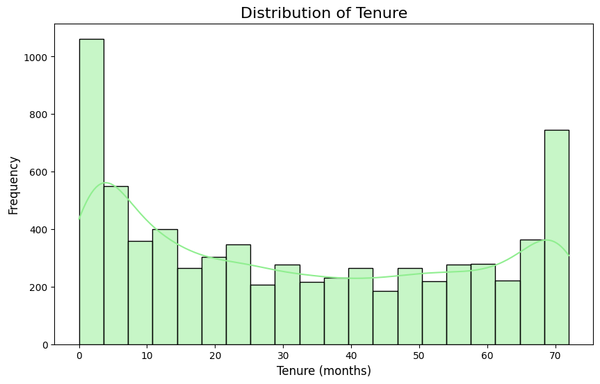

## 📉 Telecom Customer Churn Analysis with Python

### 🔍 Project Overview

This project analyzes and predicts customer churn using Python and machine learning techniques. It uses real-world telecom data to identify the key drivers of churn and build classification models to proactively prevent customer loss.

### 📁 Project Structure

* 📄 `ChurnAnalysis.ipynb`: Full Python code in a clean and well-documented Colab notebook.
* 📊 Data Source: [Telco Customer Churn Dataset on Kaggle](https://www.kaggle.com/datasets/blastchar/telco-customer-churn)

---

### 🎯 Objectives

* Understand patterns in customer behavior that lead to churn.
* Explore statistical features using EDA.
* Visualize customer characteristics and trends.
* Build classification models to predict churn.
* Recommend strategic actions based on insights.

---

### 🧠 Key Questions Addressed

* What types of customers are more likely to churn?
* Does contract type or monthly charges influence churn?
* Can we predict churn with high accuracy using machine learning?

---

### 📊 Exploratory Data Analysis (EDA)

* **Distributions:** Tenure, MonthlyCharges, TotalCharges
* **Central Tendencies:** Mean, Median, Mode
* **Visualizations:** Histograms, Boxplots, Scatterplots, Heatmaps
* **Categorical Insights:** Churn by Contract, Payment Method, Internet Service, etc.

📷 *Example Visuals:*

*

* Heatmap of Feature Correlations

---

### 🤖 Machine Learning Models

#### ✅ Classification

* **Target:** `Churn (Yes/No)`
* **Models:**

  * Random Forest Classifier (best performing)
  * Logistic Regression
  * XGBoost (optional for future)
* **Evaluation Metrics:**

  * Accuracy: \~78.7%
  * Precision: 65.0%
  * Recall: 42.5%
  * F1 Score: 51.4%
  * Confusion Matrix & Classification Report

#### 📈 Regression (Optional Insight)

* **Target:** `MonthlyCharges` (continuous variable)
* **Model:** Random Forest Regressor
* **Evaluation:** R² \~0.9976, RMSE \~1.46

---

### 💡 Business Insights

* **High churn risk:** Customers with month-to-month contracts and high monthly charges.
* **Loyal customers:** Tend to have longer tenure, use bundled services.
* **Actionable strategies:**

  * Promote long-term contracts
  * Improve onboarding experience
  * Offer discounts to high-value customers

---

### 📦 Requirements

```bash
Python 3.x
pandas
numpy
matplotlib
seaborn
scikit-learn
```

Install via:

```bash
pip install pandas numpy matplotlib seaborn scikit-learn
```

---

### ▶️ How to Run

1. Clone this repository

```bash
git clone https://github.com/sefabckn/churn-analysis.git
```

2. Open the `ChurnAnalysis.ipynb` in Google Colab or Jupyter Notebook
3. Run the cells step-by-step to see the analysis and modelling

---

### 📚 References

* [Telco Churn Dataset – Kaggle](https://www.kaggle.com/datasets/blastchar/telco-customer-churn)
* Scikit-learn Documentation
* Python Data Science Libraries

---

### 🙌 Author

**Sefa Bockun**
Data Analyst | MBA in Data Science
📍 Nowy Sącz, Poland
📫 [LinkedIn](https://www.linkedin.com/in/sefabockun)

